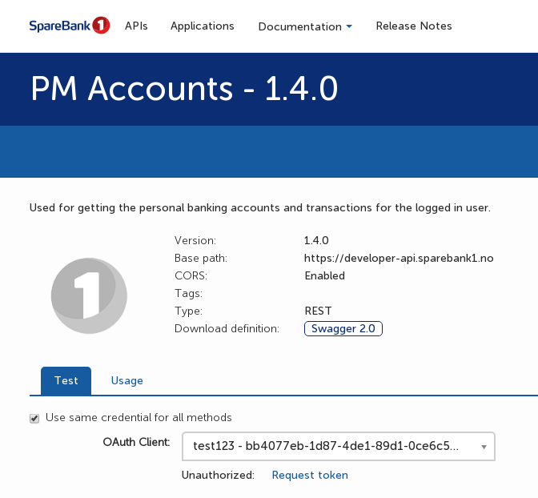
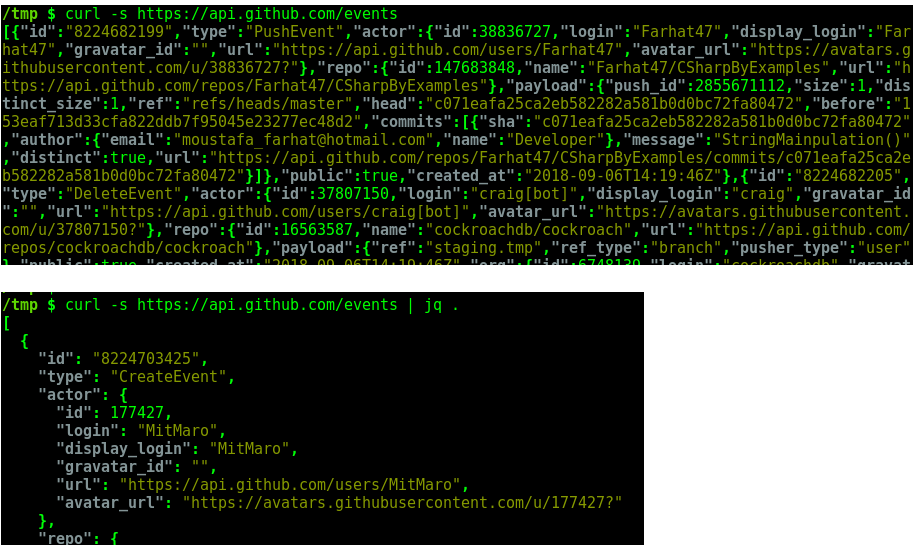

# 1) Uppstart

### Uppgift 

**1) Clone'a detta repo**

    $ git clone https://github.com/SpareBank1/sb1fs

**2) Bygg repo't:**

 
    $ cd sb1fs
    $ ./mvnw clean install 
 
**3) Se till att få installert [prerequisties før din plattform](README.md#prerequisites)**
 
Se vidare i [README.md](README.md#prerequisites)

**4) Skapa katalog att montera filsystemet på**

    $ mkdir tmp
    
**5) Verifiera att du kan køra exempel-filsystemet på din maskin**

Starta via kommandolinjen
    
    $ java -jar target/sb1fs-0.0.1-SNAPSHOT.jar --mountPath=tmp

Eller kør klassen

    no.sparebank1.sb1fs.Start

i din IDE.
    
**6) Øppna en ny terminal och utforska exempel-filsystmet**

    $ ls tmp
 
Finner du ut vilken typ av data som exponeras av filsystemet?

### Tips

* Vill du se en slide från presentationen igen? Hela presentation ær [tillgænglig](https://sparebank1.github.io/sb1fs/) på github pages.

# 2) Registrering i SpareBank 1 och visning av konto-saldo

### Førberedelse

1) Registrera dig på [SpareBank 1 utvecklarportal](https://developersparebank1.no/) (under "Sign in" i toppmenyn)
2) Registrera en godtycklig "applikation" (under "Applications" i toppmenyn) och ge den tillgång till "PM Accounts" API:t.
3) Generer "OAuth Credentials" (bruk standardval) før applikationen.
4) Gå in under "PM-Accounts" i "API"-katalogen  (under "APIs" i toppmenyn) och generera Access-token før din applikation.

5) Utforsk konto-API't i utvecklarportalen eller lokalt med f.eks. ``curl`` eller Postman:

Med ``curl``:

    $ curl -H "Authorization: Bearer DITT_ACCESS_TOKEN" https://developer-api.sparebank1.no/open/personal/banking/accounts/all
    
### Uppgift
**Implementera visning av brukarens saldo som en egen fil i filsystemet. Bruk koden i  
[``no.sparebank1.sb1fs.app.Sb1FsApplication``](../master/src/main/java/no/sparebank1/sb1fs/app/Sb1FsApplication.java)
 som utgångspunkt.**

### Tips
* Startar du via kommandolinjen med java -jar så måste du ændra vilken kode som kørs, se 
[``no.sparebank1.sb1fs.Start``](../master/src/main/java/no/sparebank1/sb1fs/Start.java).

* Funktionen ``getSubnodes()`` i [``no.sparebank1.sb1fs.app.Sb1FsApplication``](../master/src/main/java/no/sparebank1/sb1fs/app/Sb1FsApplication.java) 
ær en læmplig plats før koden du kommer skriva.

* JSON-responser kan bli lættare att læsa om de pretty-printa's med jq (kan installeras på Mac med ``brew install jq``):

# 3) Visning av transaktioner

### Uppgift

Varje konto har en korresponderande REST-resurs som representerar transaktioner på konto. URL till resursen finner du i 
konto JSON-responsen. Før att konsumera resursen trenger du implementera matchande DTO-klasser.
 
**Implementera varje transaktion som en egen fil i respektive konto-katalog. Vælj ett filnamn som indentifierar transaktionen, 
filen kan ha øvrig transaktionsdata som innehåll.**

### Tips 
 * [quicktype](https://github.com/quicktype/quicktype) ær ett smidigt alternativ før att generera upp Jersey-kompatible DTO-klasser från JSON-exempeldata. 
Installera med:

   
    $ npm i -g quicktype 
    
och, givet att du har lastat ned JSON-data från transaktionsdata-resursen till filen ``transactions.json``, prøv:

    $ quicktype -o . --top-level ApiAccounts --lang java --package no.sparebank1.sb1fs.api.transactions transactions.json 

 * Ønskar du inte att testa ut quicktype så kan DTO-klasser før transaktionsdata hæmtas in med git:
 
 
    $ git cherry-pick -n canned-dtos
    
# 4) Førslag på olika hacks och extrauppgifter 

### A: Implementera øverføring mellan konto

Det finns ett eget API før konto-øverføringar. Kall till detta kan implementeras med filsystemsemantik t.ex. så att:

    $ mv 6001050032/saldo/520.kr 8001050032/saldo/20.kr
    
øverfør 20 kronor från kontot 6001050032 till kontot 8001050032. 

### Tips

Override'a rename-funktionen i no.sparebank1.sb1fs.Sb1fs.     

### B: Aggregera data

Men kan implementera egna filer som på konto-nivå, och/eller globalt, aggregera data som f.eks.:

 * Utgående beløp per månad
 * Mest brukta betalingsmottagare
 * etc
 
### C: Korrekta timestamps på transaktionsfiler 

Det ær møjligt att sætta meningsfulla timestamps på ``FileNode``-instanser (før kode se 
[``no.sparebank1.sb1fs.saul.SaulFs``](../master/src/main/java/no/sparebank1/sb1fs/saul/SaulFs.java)). 
Før transaktionsfiler kan det vara logiska att sætta timestamp till betalingsdatum. Då blir det møjligt att lista 
transaktioner før ett visst konto kronologiskt med:

    $ ls -lt